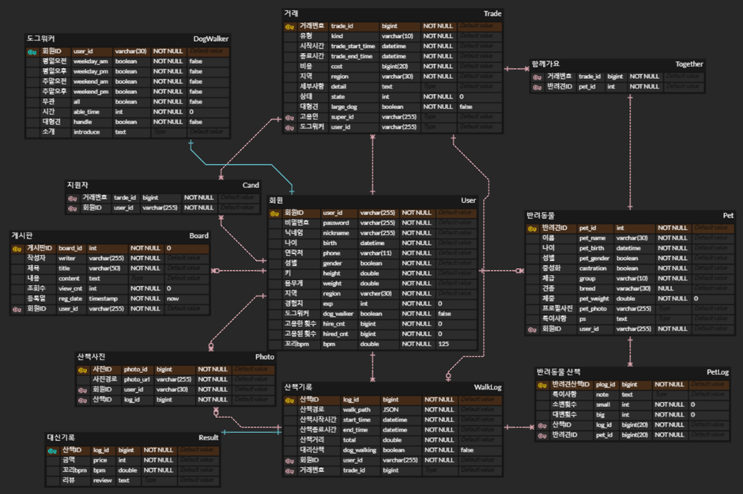
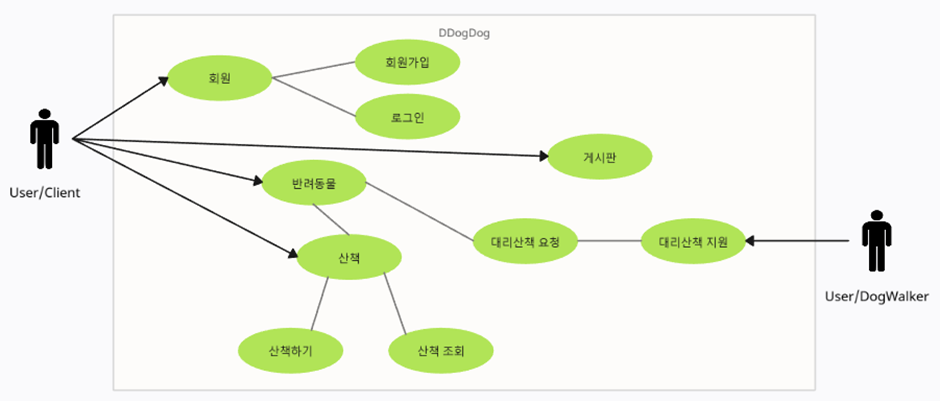
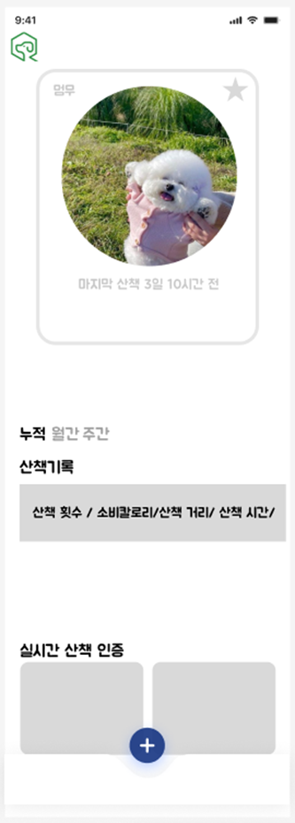
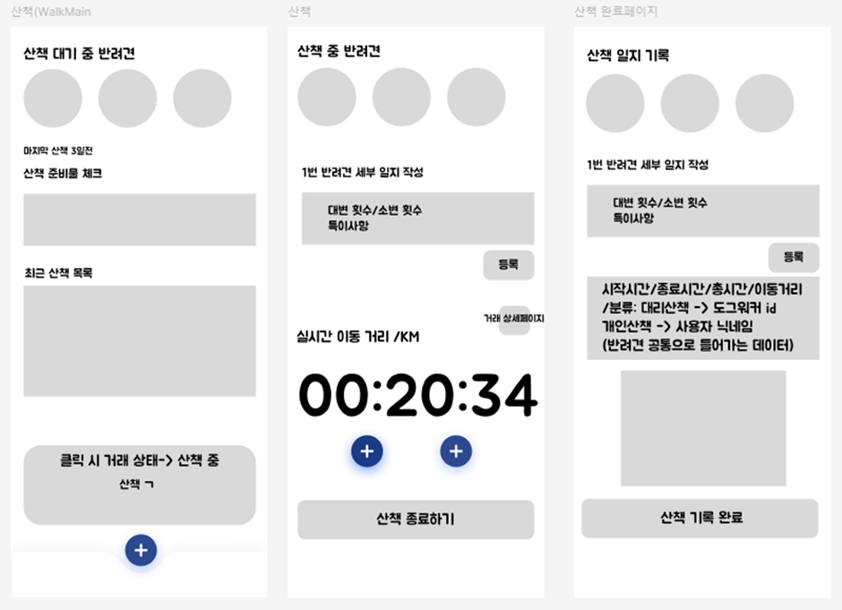
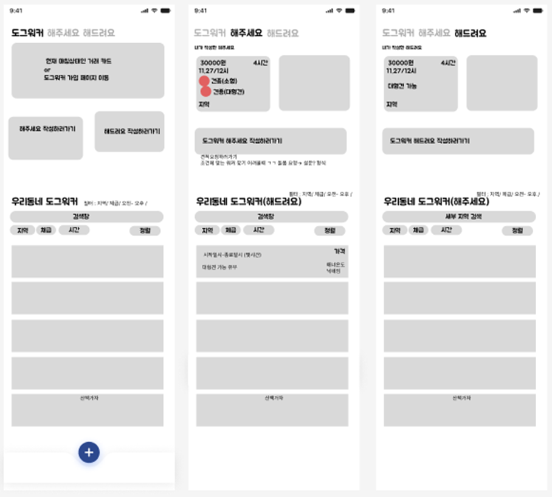
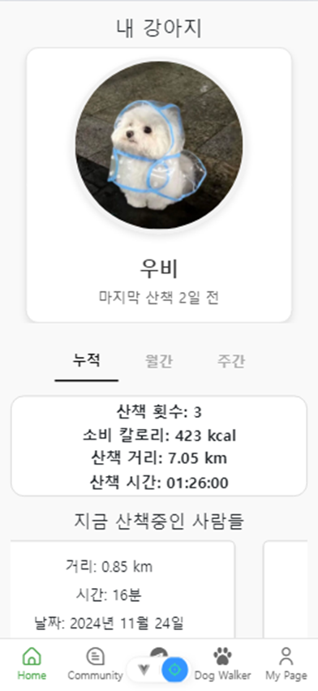
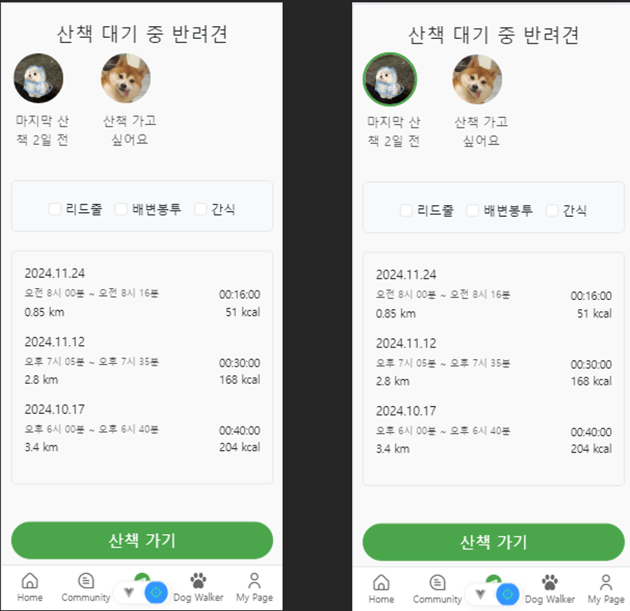
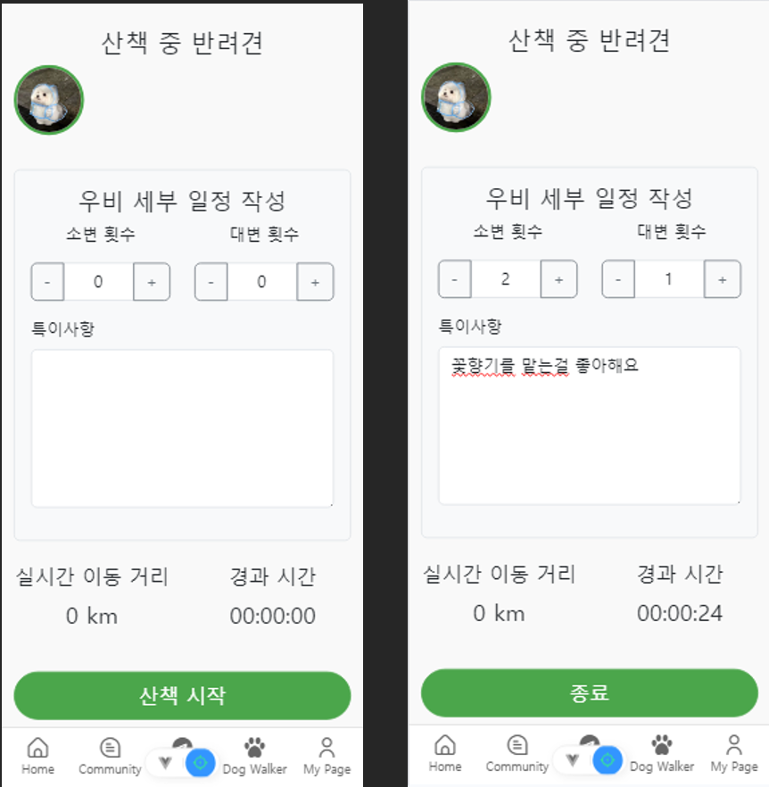
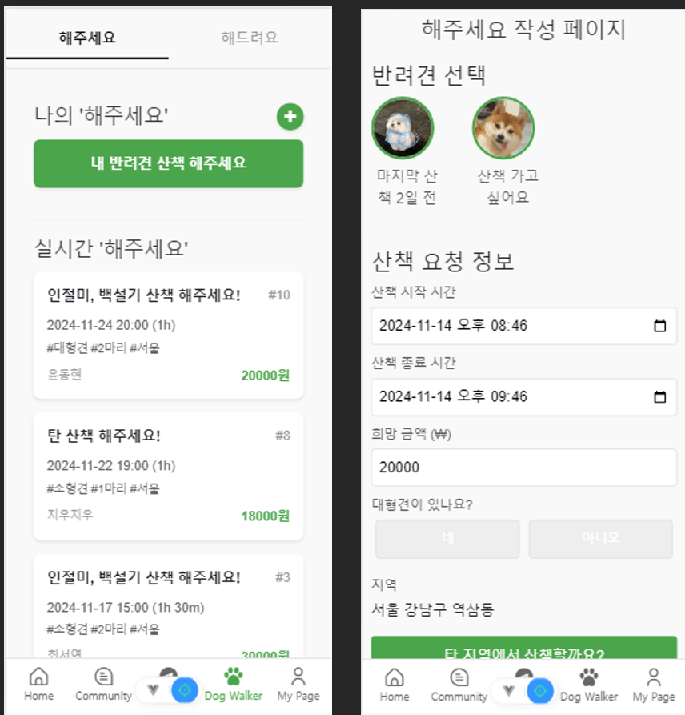
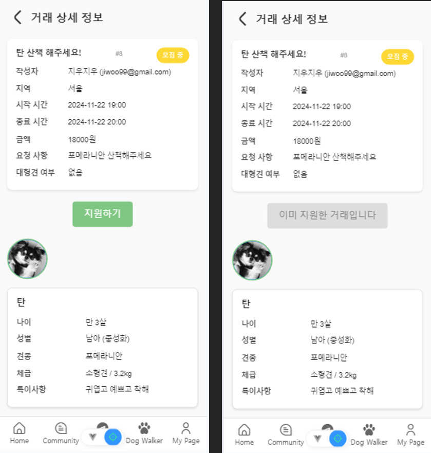

# DDogDog 프로젝트

DDogDog은 프론트엔드와 백엔드로 구성된 통합 웹 애플리케이션 프로젝트입니다. 이 문서는 프로젝트 구조, 사용 방법, 그리고 주요 구성 요소에 대해 설명합니다. doc폴더에 문서가 있습니다.

---

## 프로젝트 구조

```
프로젝트/
├── BackEnd/        # 백엔드 소스 코드 및 설정 파일
├── FrontEnd/       # 프론트엔드 소스 코드
```

---

## BackEnd

### 파일 및 디렉토리 구조

```
BackEnd/
├── .gitignore       # Git에서 제외할 파일 및 디렉토리 정의
├── .idea/           # JetBrains 계열 IDE 설정 파일
├── DDogDog/         # 백엔드 소스 코드 디렉토리
├── final.sql        # 데이터베이스 초기화 및 스키마 정의 SQL 파일
├── README.md        # 백엔드 관련 README 파일
```

---

### 주요 내용

- **.gitignore**: 불필요한 파일이 Git에 포함되지 않도록 설정.
- **.idea/**: JetBrains IDE를 사용할 경우의 프로젝트 설정 디렉토리.
- **DDogDog/**: 백엔드 애플리케이션 소스 코드 디렉토리.
- **final.sql**: 데이터베이스 초기화 및 테이블 생성에 필요한 SQL 파일.

---

### ERD



### 사용 방법

1. 데이터베이스 초기화:
   ```bash
   mysql -u [사용자명] -p < BackEnd/final.sql
   ```
2. `DDogDog` 디렉토리로 이동하여 애플리케이션을 실행합니다:
   ```bash
   cd BackEnd/DDogDog
   python app.py
   ```

---

### 유즈케이스



---

## FrontEnd

### 파일 및 디렉토리 구조

```
FrontEnd/
├── ddogdog2/        # 프론트엔드 애플리케이션 소스 코드 디렉토리
```

### 주요 내용

- **ddogdog2/**: Vue.js 또는 React 기반의 프론트엔드 애플리케이션 소스 코드 디렉토리.

### 사용 방법

1. 디렉토리로 이동:
   ```bash
   cd FrontEnd/ddogdog2
   ```
2. 의존성 설치 및 실행:
   ```bash
   npm install
   npm run serve
   ```

---

### Figma

메인 화면



산책 화면



도그워커 화면



---

### 실제 화면

메인 화면



산책 화면





도그워커 화면





## 통합 실행

1. **BackEnd**와 **FrontEnd**를 각각 설정하고 실행합니다.
2. 백엔드와 프론트엔드가 동일한 네트워크 환경에서 통신할 수 있도록 설정합니다.
3. 웹 브라우저에서 프론트엔드 URL을 통해 애플리케이션을 확인합니다.

---

## 기타 정보

- 프로젝트 개발 시 사용된 주요 기술:
  - 백엔드: Python, Flask, MySQL
  - 프론트엔드: JavaScript, Vue.js/React (디렉토리 분석 필요)
- 데이터베이스 스키마는 `BackEnd/final.sql` 파일을 참고하세요.
